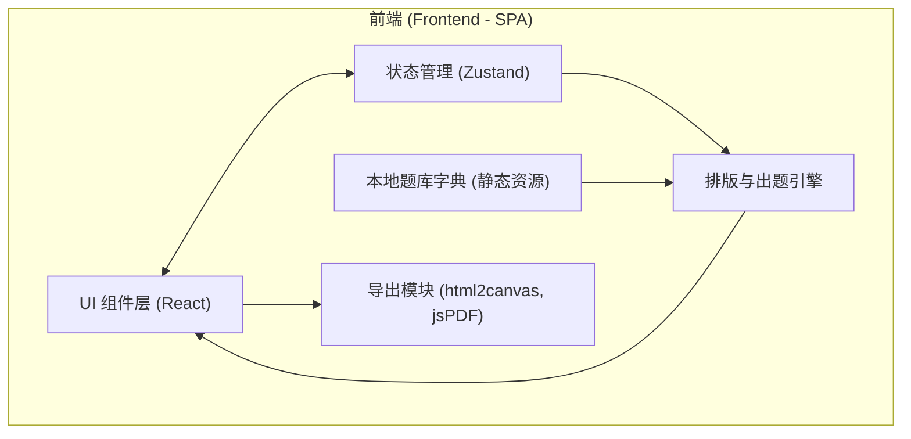

## 1. 架构设计


## 2. 技术说明
- **前端框架**: React@18 + TypeScript + Vite
- **样式方案**: Tailwind CSS@3
- **状态管理**: Zustand (带 localStorage 持久化)
- **拖拽排序**: @dnd-kit/core 及相关工具库
- **拼音转换**: pinyin-pro
- **PDF/图片导出**: html2canvas + jspdf
- **图标库**: lucide-react

## 3. 路由定义
由于是单一功能的工具应用，采用单页架构。
| 路由 | 用途 |
|-------|---------|
| / | 首页，包含左侧控制台与右侧预览区 |

## 4. API 定义
无后端，完全纯前端实现。

## 5. 数据模型 (前端数据结构定义)

### 5.1 题库与题目模型
```typescript
// 难度
type Difficulty = 'basic' | 'intermediate' | 'advanced';

// 题型
type TopicType = 
  | 'pinyin_to_char' 
  | 'char_to_pinyin' 
  | 'stroke_order'
  | 'synonym_antonym'
  | 'similar_char'
  | 'quantifier'
  | 'dictionary'
  | 'word_chain'
  | 'multi_pronunciation'
  | 'idiom'
  | 'modify_sentence'
  | 'conjunction'
  | 'ba_bei_sentence'
  | 'expand_shrink_sentence'
  | 'rhetoric'
  | 'poem'
  | 'direct_indirect'
  | 'emotion_color'
  | 'proverb'
  | 'literature'
  | 'classical_chinese'
  | 'imitate_sentence';

// 单个题目对象
interface ChineseProblem {
  id: string;
  type: TopicType;
  content: string; // 题干
  options?: string[]; // 选项（如果是选择题）
  answer: string; // 答案
  pinyin?: string; // 拼音（如果是拼音题）
  isContinued?: boolean; // 是否是跨页的续题标记
}

// 题型配置项
interface TopicConfig {
  id: TopicType;
  name: string;
  enabled: boolean;
  columns: 1 | 2 | 3 | 4 | 'auto';
  count: number | 'auto'; // 'auto'表示按比例平分剩余配额
}

// 全局配置状态
interface AppState {
  grade: 1 | 2 | 3 | 4 | 5 | 6;
  difficulty: Difficulty;
  topics: TopicConfig[];
  totalCount: number;
  lineSpacing: number;
  guideline: 'none' | 'underline' | 'tianzige' | 'pinyin';
  showNumber: boolean;
  answerMode: 'none' | 'inline' | 'separate';
  isGrouped: boolean;
  
  // Actions
  setGrade: (grade: number) => void;
  updateTopic: (id: TopicType, config: Partial<TopicConfig>) => void;
  reorderTopics: (activeId: string, overId: string) => void;
  // ... 其他更新状态的方法
}
```

### 5.2 核心出题算法流程
1. `generateProblems()`: 根据当前的 `AppState`。
2. 筛选出 `enabled: true` 的 `topics`。
3. 根据 `totalCount` 和每个 topic 的 `count` 计算实际出题数。
4. 从静态字典库 `/src/data/` 中按 `grade` 和 `difficulty` 抽取素材。
5. 组装成 `ChineseProblem[]`，根据题型聚合，并计算分页标记。
