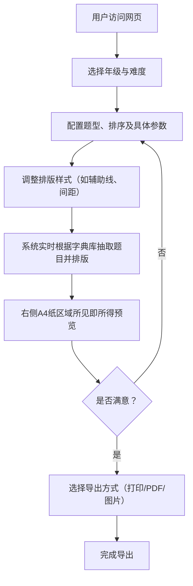

## 1. 产品概述
一款面向家长和语文教师的“小学1-6年级语文练习题生成器”单页Web应用。
- 解决网络资料分散、质量低、缺乏专项训练能力及打印体验差的痛点。
- 提供零门槛、无广告、所见即所得的极速个性化出题与完美物理打印体验。

## 2. 核心功能

### 2.1 角色设定
| 角色 | 注册方式 | 核心权限 |
|------|---------------------|------------------|
| 普通用户 | 无需注册 | 浏览、配置、生成及导出（打印/PDF/图片）语文练习题 |

### 2.2 功能模块
1. **控制面板 (Sidebar)**：包含基础设置、题型配置与排序、题目参数与总数、语文特有排版设置。
2. **预览与打印区 (Preview Area)**：实时所见即所得预览、A4 智能排版引擎、导出功能（打印、PDF、图片）。

### 2.3 页面详情
| 页面名称 | 模块名称 | 功能描述 |
|-----------|-------------|---------------------|
| 首页 | 控制面板 - 基础设置 | 年级选择（一至六年级），难度层级单选（基础/提升/拓展） |
| 首页 | 控制面板 - 题型配置 | 题型多选、拖拽排序、归类开关、单题型排版列数及题数控制 |
| 首页 | 控制面板 - 参数与排版 | 总题目数滑块、行间距微调、留白辅助线选择、题号开关、答案模式 |
| 首页 | 预览区 - 智能排版 | 实时A4纸预览、跨页截断保护、多列混排渲染、表头信息展示 |
| 首页 | 预览区 - 导出功能 | 调用浏览器原生打印、导出为PDF文件、导出为图片 |

## 3. 核心流程
用户进入页面后，通过左侧控制面板进行一系列个性化设置，右侧预览区实时响应并重新渲染。满意后点击导出或打印。

## 4. 用户界面设计
### 4.1 设计风格
- **主次色调**：以原木色、护眼绿为主，营造轻松的教育类应用氛围。
- **按钮样式**：圆角矩形，轻微阴影，悬停时有柔和的反馈。
- **字体与大小**：界面UI采用系统默认无衬线字体（如 Inter, PingFang SC），预览区题目正文采用清晰易读的楷体或宋体，拼音采用合适的无衬线字体。
- **排版布局**：左侧固定侧边栏（控制面板），右侧自适应宽度的滚动预览区（灰色背景衬托白色A4纸张效果）。
- **图标风格**：简洁的线框图标，用于题型拖拽、打印、下载等操作。

### 4.2 页面设计概览
| 页面名称 | 模块名称 | UI 元素 |
|-----------|-------------|-------------|
| 首页 | 侧边栏 (Sidebar) | 具有良好层次感的表单项（下拉框、滑块、复选框、拖拽列表），吸顶的“导出”操作区 |
| 首页 | 预览区 (Preview) | 居中显示的带阴影 A4 纸容器，顶部固定表头，正文题目按配置的列数和辅助线（田字格、拼音线等）整齐排列 |

### 4.3 响应式设计
- **桌面端优先**：最佳体验为左侧控制台，右侧大面积预览区。
- **移动端适配**：在窄屏设备上，控制面板可通过抽屉（Drawer）或底部弹窗形式展示，预览区支持手势缩放。
- **打印优化**：提供专门的 `@media print` 样式，隐藏控制台和背景，仅保留A4纸张内容，去除不必要的阴影和边框。
