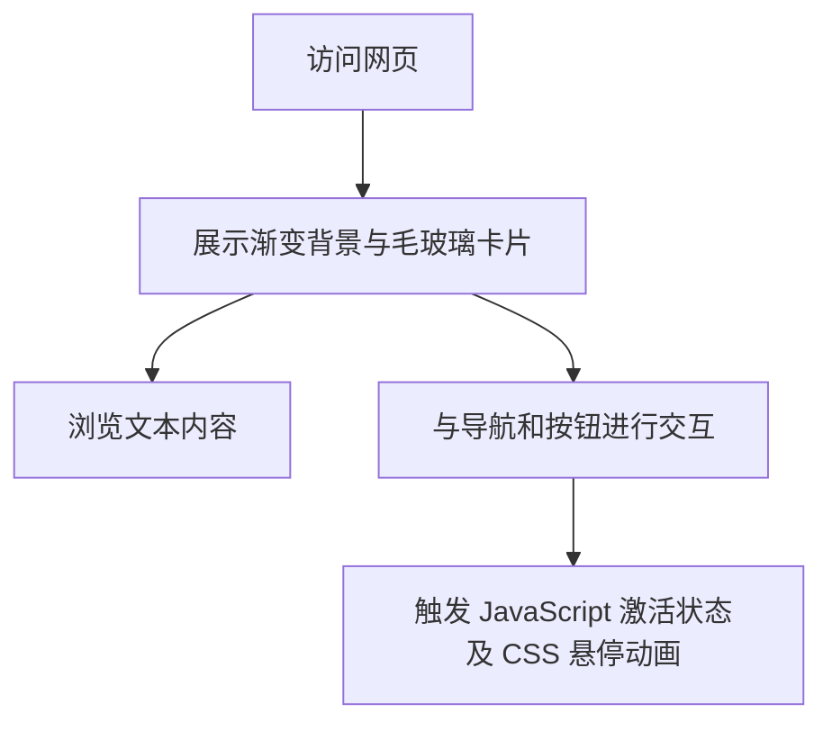

## 1. 产品概述
实现一个基于 HTML5 的 iOS 26 风格毛玻璃效果页面。
- 该页面旨在演示和实现现代网页中的毛玻璃（Glassmorphism）UI 设计风格，通过前端技术呈现高级的视觉体验。
- 适合作为个人主页、产品展示页或导航页的基础模板。

## 2. 核心功能

### 2.1 用户角色
无特定用户角色，适合所有访问者浏览。

### 2.2 功能模块
1. **毛玻璃卡片展示区**：展示带有背景模糊和渐变的高级卡片。
2. **导航与交互模块**：包含点击高亮的导航链接和悬停效果按钮。

### 2.3 页面详细描述
| 页面名称 | 模块名称 | 功能描述 |
|-----------|-------------|---------------------|
| 首页 | 背景模块 | 深色/亮色渐变背景，全屏覆盖 |
| 首页 | 毛玻璃卡片 | 居中显示，具有半透明和背景模糊效果的容器 |
| 首页 | 内容展示区 | 包含各级标题和段落文字 |
| 首页 | 交互组件区 | 包含导航链接（点击切换激活状态）和玻璃质感按钮（悬停微动效果） |

## 3. 核心流程
用户访问网页 -> 查看毛玻璃视觉效果 -> 点击导航项查看激活状态切换 -> 悬停按钮查看交互动画。

## 4. 用户界面设计
### 4.1 设计风格
- 主次颜色：深蓝渐变背景（#4b6cb7 到 #182848），白色半透明卡片背景（rgba(255, 255, 255, 0.15)）。
- 按钮风格：玻璃质感，包含白色半透明边框，悬停时背景加深并带有轻微上浮动画（translateY(-2px)）。
- 字体与排版：无衬线现代字体，清晰的层级关系（一级标题、二级标题、正文段落）。
- 布局风格：Flexbox 弹性布局，内容垂直居中排列，卡片式 UI。
- 视觉特效：高饱和度（saturate(180%)）与强模糊（blur(20px)）组合的毛玻璃效果（backdrop-filter）。

### 4.2 页面设计概览
| 页面名称 | 模块名称 | UI 元素 |
|-----------|-------------|-------------|
| 首页 | 渐变背景 | `linear-gradient` 全屏背景 |
| 首页 | 毛玻璃卡片 | 带有 `backdrop-filter` 和半透明边框的 `div` 容器 |
| 首页 | 交互元素 | `a` 标签导航项，`button` 玻璃质感按钮 |

### 4.3 响应式设计
- 使用相对单位（%、rem 等）。
- 限制卡片最大宽度（max-width: 400px）。
- 移动端适配：屏幕宽度小于 768px 时减小卡片内边距。
