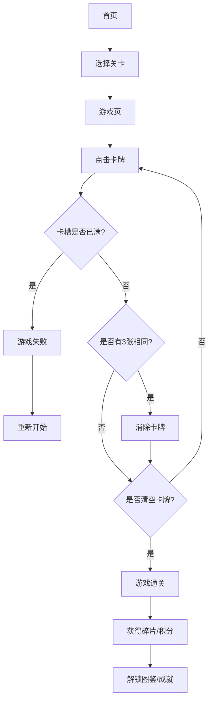

## 1. 产品概述
纯前端单机版分层三消闯关游戏（“消了个消”仿写）
- 主打“低门槛入门、高难度进阶”，以“消除闯关+碎片收集”为双核心，兼顾轻量化操作与趣味性。
- 面向全年龄段用户，界面简约干净，适配手机端，无需联网即可体验“越玩越上头”的消除快感。

## 2. 核心功能

### 2.1 核心玩法模块
1. **分层消除**：卡牌分层摆放，底层被遮挡不可点击，消除上层后露出下层。
2. **临时卡槽**：最多容纳一定数量（默认设定为7个，以保证游戏可玩性，提示要求最少3个，可动态调整）的卡牌，点击卡牌进入卡槽，满3个相同即消除。
3. **关卡进阶**：普通、困难、精英三级关卡，难度递增。
4. **道具系统**：移除卡、提示卡、洗牌卡、扩容卡。
5. **收集系统**：通关收集碎片和积分，解锁新卡牌图案或皮肤，以及成就系统。

### 2.2 页面详情
| 页面名称 | 模块名称 | 功能描述 |
|-----------|-------------|---------------------|
| 首页 (Home) | 主菜单 | 关卡选择、收集图鉴入口、成就展示 |
| 游戏页 (Game) | 核心游戏区 | 分层卡牌点击、临时卡槽消除、道具使用、失败/通关提示 |
| 收集图鉴 (Collection) | 碎片/皮肤展示 | 碎片解锁进度、积分兑换皮肤、成就列表 |

## 3. 核心流程
玩家进入游戏首页 -> 选择关卡进入游戏 -> 点击卡牌收集至卡槽 -> 凑齐3张消除 -> 消除所有卡牌通关 -> 获得碎片/积分奖励 -> 解锁新图案/皮肤。若卡槽满则失败重来。

## 4. 用户界面设计
### 4.1 设计风格
- 极简、干净、现代化的扁平风格。
- 主色调：柔和的浅色背景（如米白、浅灰或淡蓝），配以色彩鲜明的卡牌元素（Emoji或扁平化图标）。
- 字体：圆润、易读的无衬线字体。
- 布局：移动端优先（Mobile-first），竖屏布局。
- 动画：轻量级的 CSS 动画（点击反馈、消除闪烁）。

### 4.2 页面设计概览
| 页面名称 | 模块名称 | UI 元素 |
|-----------|-------------|-------------|
| 游戏页 | 卡牌区 | 多层重叠的卡牌，带阴影和圆角，未解锁卡牌带有半透明灰色遮罩 |
| 游戏页 | 卡槽区 | 底部固定区域，清晰的卡槽空位，消除时的动画 |
| 游戏页 | 道具区 | 底部工具栏，显示剩余次数，禁用时置灰 |

### 4.3 响应式设计
- 优先适配移动设备（iPhone, Android），确保在窄屏下卡牌点击区域足够大，防止误触。
- 桌面端居中显示模拟手机界面（max-width: 480px）。