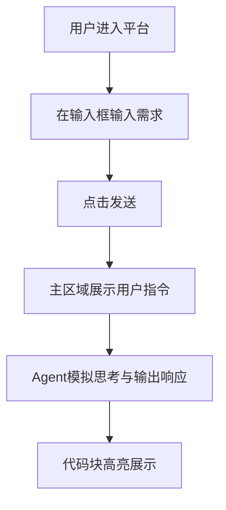

## 1. 产品概述
构建一个基于网页的Agent交互平台，整体风格高度还原OpenAI Codex的经典深色系、极简且专业的UI设计。
- 核心目的是通过极致简约的界面，为用户提供一个专注于代码生成与对话式编程的模拟环境。
- 目标用户为开发者与AI爱好者，追求高效率、低干扰的沉浸式编程与对话体验。

## 2. 核心功能

### 2.1 角色定义
- 本应用暂无复杂权限区分，所有访问者均可直接体验对话生成代码的核心流程。

### 2.2 功能模块
1. **侧边栏 (Sidebar)**: 包含新建对话按钮、历史会话列表、以及底部的用户/设置入口。
2. **主对话区 (Chat & Editor Area)**: 展示用户指令与Agent生成的代码响应，支持代码高亮与一键复制。
3. **输入区 (Input Area)**: 位于页面底部或中下部，支持多行输入与快捷发送。
4. **代码输出区 (Code Block)**: 经典的代码展示框，带语言类型提示和一键复制功能。

### 2.3 页面详情
| 页面名称 | 模块名称 | 功能描述 |
|-----------|-------------|---------------------|
| 主界面 | 侧边栏 | 管理历史对话记录，点击可切换上下文。 |
| 主界面 | 对话流 | 气泡式或平铺式展示用户Prompt与Agent响应，代码块带高亮及语言标签。 |
| 主界面 | 底部输入框 | 带有发送按钮的自适应高度输入框，支持快捷键(Enter发送, Shift+Enter换行)。 |

## 3. 核心流程
用户进入平台 -> 在底部输入框输入需求（如“帮我写一个按钮”） -> 点击发送 -> 主对话区出现用户内容 -> Agent开始流式输出（模拟） -> 呈现高亮代码块。

## 4. 用户界面设计
### 4.1 设计风格
- **主色调与背景**: 经典Codex深色主题（背景色如 `#000000` 或 `#111111`，输入框和侧边栏使用极暗灰如 `#1A1A1A`），文字采用高对比度的灰白色（如 `#ECECEC` 或 `#A3A3A3`）。
- **组件样式**: 极致克制的微圆角（如 4px-6px），摒弃多余阴影或边框，通过微小的背景色差划分区域。
- **排版与字体**:
  - 正文：无衬线字体（Inter, System fonts）。
  - 代码：等宽字体（JetBrains Mono, Fira Code 或 Consolas），提升专业感。
- **图标**: 使用细线风格的极简图标（如 Lucide Icons）。

### 4.2 页面设计总览
| 页面名称 | 模块名称 | UI元素设计 |
|-----------|-------------|-------------|
| 主界面 | 整体布局 | 左侧边栏（固定宽度，约260px），右侧主操作区填充剩余空间（Flex）。 |
| 主界面 | 输入框 | 纯粹深灰背景，无边框或极弱边框，聚焦时边框微亮。 |
| 主界面 | 代码块 | 顶部带有语言标识的深色极简卡片，代码高亮色彩克制（冷色调为主）。 |

### 4.3 响应式设计
优先适配桌面端（Desktop-first），侧边栏在移动端可折叠为汉堡菜单，主对话区自适应宽度。
