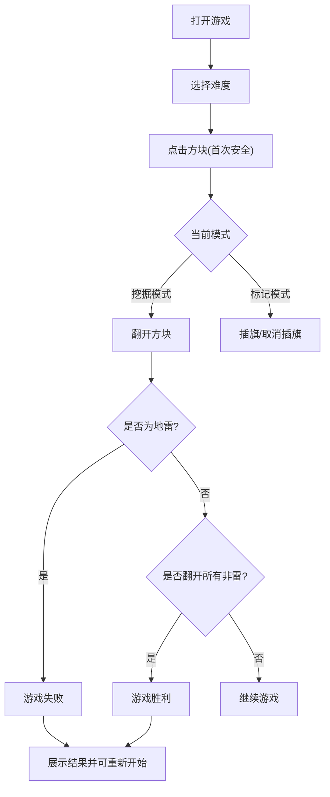

## 1. 产品概述
一个专为移动端优化的经典扫雷网页小游戏，让用户随时随地在手机上体验原汁原味的逻辑推理乐趣。
- 主要解决移动端网页游戏中操作不够便捷（如右键标记地雷）的问题，通过触屏优化的交互（如长按标记、模式切换）提升游戏体验。
- 产品目标是提供一个轻量、流畅、美观的休闲解谜游戏，适合碎片时间游玩。

## 2. 核心功能

### 2.1 难度分级
| 级别 | 棋盘尺寸 | 地雷数量 | 适用场景 |
|------|----------|----------|----------|
| 初级 | 9 x 9    | 10       | 快速游戏，适合竖屏完整显示 |
| 中级 | 16 x 16  | 40       | 需要一定的滚动或缩放操作 |
| 高级 | 16 x 30  | 99       | 核心玩家，深度逻辑推理 |

### 2.2 功能模块
1. **游戏主页**：难度选择、游戏主界面、状态栏、操作模式切换。
2. **结算页面**：游戏胜利/失败弹窗、用时统计、重新开始按钮。

### 2.3 页面详情
| 页面名称 | 模块名称 | 功能描述 |
|-----------|-------------|---------------------|
| 游戏主页 | 状态栏 | 显示剩余地雷数、游戏用时、重置/笑脸按钮 |
| 游戏主页 | 游戏棋盘 | 渲染格子阵列，支持点击翻开、长按或双击标记 |
| 游戏主页 | 底部控制栏 | 提供“挖掘”与“标记”模式的快捷切换开关，解决手机端长按效率低的问题 |
| 结算弹窗 | 结果展示 | 胜利时撒花动画，失败时显示所有地雷及错误标记 |

## 3. 核心流程
用户打开游戏后，默认进入初级难度。
用户可以通过顶部菜单切换难度。
游戏开始时，点击任意方块（首次点击保证不是雷）。
后续点击：如果在“挖掘”模式，则翻开方块；如果在“标记”模式，则插旗。
遇到地雷则游戏失败，触发所有地雷爆炸动画；翻开所有非雷方块则游戏胜利，记录时间。

## 4. 用户界面设计
### 4.1 设计风格
- 整体风格采用**新拟态（Neumorphism）**与**玻璃拟态（Glassmorphism）**结合的现代质感，摒弃传统的 Windows 98 灰色方块，打造高级、清新的移动端视觉体验。
- **主色调**：清新薄荷绿（代表安全、通关）、深邃海蓝（背景与深色主题）。
- **警示色**：珊瑚红（代表地雷、危险）。
- **按钮风格**：圆润的卡片式设计，带有柔和的阴影（未翻开）和内凹的压纹（已翻开），点击时有明显的下压动画。
- **字体**：数字采用等宽的现代无衬线字体（如 Inter, Roboto Mono），确保对齐与阅读清晰。
- **图标/表情**：采用简约线条或现代风格的 Emoji（如 😃, 😎, 😵）作为状态指示器，地雷（💣）和旗帜（🚩）图标需重新设计或使用高质量的矢量图标。

### 4.2 页面设计概览
| 页面名称 | 模块名称 | UI 元素 |
|-----------|-------------|-------------|
| 游戏主页 | 状态栏 | 悬浮卡片样式，左右分布数字（红色发光效果模拟LED），中间圆形状态按钮 |
| 游戏主页 | 游戏棋盘 | 居中布局，每个格子边缘平滑，数字根据1-8分别采用蓝、绿、红、紫、褐、青、黑、灰等经典颜色但做柔和化处理 |
| 游戏主页 | 底部控制栏 | 悬浮在屏幕底部，包含一个滑动切换开关（Toggle）用于切换“挖掘（铲子）”和“标记（旗帜）” |

### 4.3 响应式设计
- **移动端优先（Mobile-first）**：主推竖屏体验。对于中级/高级的超大棋盘，支持双指缩放（Pinch-to-zoom）和单指拖动浏览（Pan），或者在底部加入快速滚动条。
- **防误触优化**：格子的点击区域(Touch Target)需达到至少 40x40 px（在初级难度下），确保手指点击准确。
- **震动反馈（Haptic Feedback）**：在支持的设备上，利用 `navigator.vibrate` 在插旗或踩雷时提供震动反馈。
- 桌面端：在屏幕中央以手机比例的卡片容器呈现游戏，背景可虚化或采用漂亮的动态渐变。
