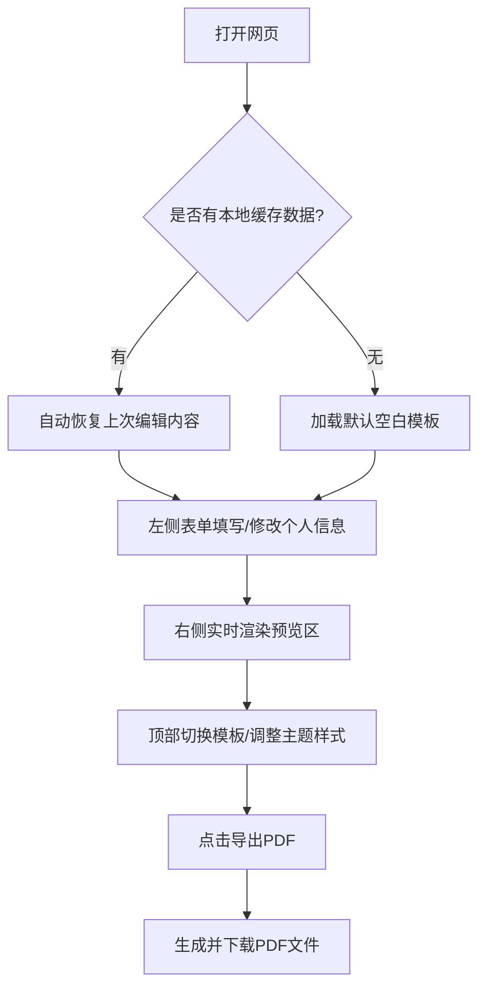

## 1. 产品概述
纯前端简历生成器是一款无后端、无需注册、即开即用的在线工具。
旨在帮助用户快速填写个人信息并实时预览，最终生成清晰无水印的PDF简历，保障用户数据绝对安全（全离线本地存储）。

## 2. 核心功能

### 2.1 用户角色
| 角色 | 注册方式 | 核心权限 |
|------|---------------------|------------------|
| 普通用户 | 无需注册 | 填写简历、切换模板、实时预览、导出PDF |

### 2.2 功能模块
1. **简历编辑区**：基础信息、教育经历、工作实习、项目经历、技能证书、自我评价等模块。
2. **样式控制区**：模板切换、主题色更改、排版调整（单/双列、字体大小、间距）。
3. **实时预览区**：A4纸张比例实时渲染。
4. **数据与导出控制**：本地数据自动缓存与手动清空、一键导出PDF。

### 2.3 页面详情
| 页面名称 | 模块名称 | 功能描述 |
|-----------|-------------|---------------------|
| 首页 | 欢迎引导 | 简短介绍产品亮点，提供“立即创建”入口 |
| 编辑页 | 顶部操作栏 | 选择模板（4-6套）、调整主题色/样式、导出PDF按钮 |
| 编辑页 | 左侧信息表单 | 各个简历维度的信息输入与管理（支持排序、删除、新增），图片本地上传压缩 |
| 编辑页 | 右侧预览区 | A4尺寸模拟，输入内容实时同步渲染，分页提示 |

## 3. 核心流程
用户打开网页后，自动读取本地存储的简历数据。用户在左侧表单填写/修改内容，右侧实时更新预览。调整模板或颜色后，点击导出PDF下载文件，或点击清空重置数据。

## 4. 用户界面设计
### 4.1 设计风格
- 主色调：支持多主题色切换（经典蓝、商务灰、活力绿等），默认使用专业且克制的蓝灰色系。
- 按钮风格：微圆角、扁平化，带轻微的悬浮阴影（现代极简风）。
- 字体：使用系统默认无衬线字体（如 Inter, Roboto, PingFang SC）以保证清晰易读，标题可搭配有质感的衬线字体。
- 布局：左侧滚动表单区（占约35%），右侧固定预览区（占约65%，居中显示A4画布）。
- 交互：输入防抖、拖拽排序、平滑过渡动画。

### 4.2 页面设计概览
| 页面名称 | 模块名称 | UI元素 |
|-----------|-------------|-------------|
| 编辑页 | 顶部导航 | Logo、模板下拉框、颜色选择器、导出按钮（主按钮强调） |
| 编辑页 | 表单区 | 各种输入框、富文本多行输入、拖拽排序图标、展开/折叠面板 |
| 编辑页 | 预览区 | 灰色背景上的白纸效果（带阴影），实时渲染的简历组件 |

### 4.3 响应式设计
以PC端（Desktop-first）为绝对主导，因为排版和PDF生成在PC端体验最佳。移动端仅提供简单的浏览提示，建议在电脑端进行编辑和导出。