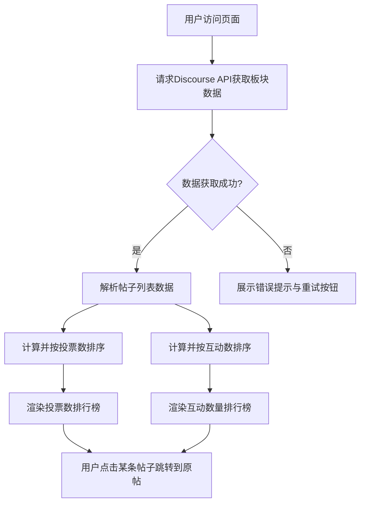

## 1. 产品概述
构建一个基于Discourse API的Web页面，专门用于展示Trae论坛特定板块（Category 35）的帖子排行榜。
- 解决用户难以快速发现板块内最受欢迎和最具讨论热度帖子的问题。
- 提供“投票数”和“互动数”（回复、点赞、浏览综合）两个维度的双榜单展示，方便用户多角度浏览优质内容。

## 2. 核心功能

### 2.1 功能模块
1. **首页榜单页**：页面包含顶部标题区、数据看板区和双榜单展示区（投票榜和互动榜）。

### 2.2 页面详细说明
| 页面名称 | 模块名称 | 功能描述 |
|-----------|-------------|---------------------|
| 首页榜单页 | 顶部信息栏 | 展示板块名称、更新时间、简单的页面介绍 |
| 首页榜单页 | 榜单切换器 | 允许用户在移动端切换查看“投票榜”和“互动榜”（桌面端可并排显示） |
| 首页榜单页 | 投票数排行榜 | 根据帖子的投票数（或点赞数）进行降序排列，展示排名、标题、作者、票数等 |
| 首页榜单页 | 互动数排行榜 | 根据帖子的互动数（回复+点赞等）进行降序排列，展示排名、标题、作者、互动数等 |
| 首页榜单页 | 帖子卡片 | 点击帖子卡片可直接跳转至Trae论坛原帖 |

## 3. 核心流程
用户打开页面 -> 页面自动通过Discourse API拉取Category 35的数据 -> 数据处理（计算投票数和互动数并排序） -> 渲染投票榜和互动榜 -> 用户浏览并可点击进入原帖。

## 4. 用户界面设计
### 4.1 设计风格
- **主色调**：科技感、极简风，使用深色模式（Dark Mode）为主或干净的浅色卡片风格，突出内容。可以采用紫色/蓝色作为点缀色（契合Trae品牌感）。
- **按钮/卡片风格**：圆角卡片（`rounded-2xl`），轻微的阴影悬浮效果，玻璃拟物化（Glassmorphism）或现代扁平化。
- **字体**：无衬线现代字体（如 Inter 或系统默认的现代字体）。
- **布局风格**：大屏幕下采用左右两列布局并排展示双榜，小屏幕下单列流式布局配合Tab切换。

### 4.2 页面设计规划
| 页面名称 | 模块名称 | UI 元素 |
|-----------|-------------|-------------|
| 首页榜单页 | 顶部Header | 渐变大标题，简介文字，动感的光晕背景 |
| 首页榜单页 | 榜单容器 | 两列布局卡片，列头部带有图标（如🔥代表互动，👍代表投票） |
| 首页榜单页 | 帖子列表项 | 左侧排名数字（前三名特殊高亮），中间帖子标题与作者头像，右侧数据徽章 |

### 4.3 响应式设计
- 桌面优先设计，宽屏并排展示双榜。
- 移动端适配，自动折叠为Tab切换或者上下排列，优化触摸点击区域大小。
