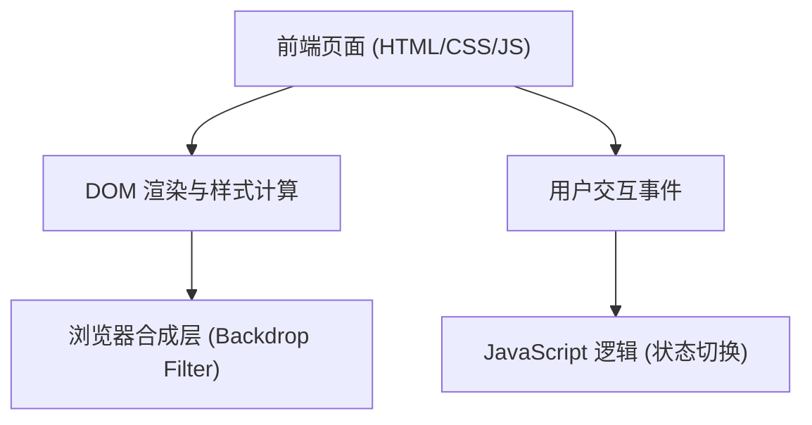

## 1. 架构设计

## 2. 技术说明
- 前端：原生 HTML5 + CSS3 + Vanilla JavaScript（根据用户“html网页”需求和博客内容采用）。
- 样式方案：原生 CSS，使用内部样式表。
- 核心技术：`backdrop-filter` 用于毛玻璃效果，`flex` 用于居中布局，`linear-gradient` 用于背景。

## 3. 路由定义
单页面应用，无前端路由，直接加载 `index.html`。

## 4. 接口定义
无后端接口。

## 5. 服务端架构图
无服务端。

## 6. 数据模型
无数据模型。
