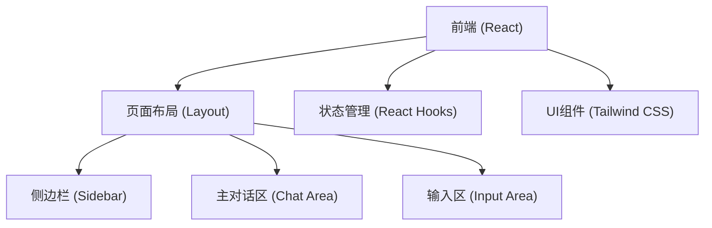

## 1. 架构设计


## 2. 技术说明
- 前端框架: React@18 + Vite
- 样式方案: Tailwind CSS@3 (用于快速构建极简深色UI，高度定制主题颜色)
- 图标库: lucide-react (提供细线风格的简约图标)
- 代码高亮: react-syntax-highlighter (用于实现Codex风格的代码块渲染，推荐使用vs2015或atom-dark主题)
- 动画: framer-motion (可选，用于气泡出现时的平滑过渡效果)

## 3. 路由定义
本应用为单页面应用(SPA)，由于是模拟平台，暂不引入复杂路由，所有交互在单一页面完成。
| 路由 | 用途 |
|-------|---------|
| / | 平台主界面 |

## 4. 数据模型
由于是纯前端模拟项目，使用React State进行内存状态管理，提供初始的Mock数据以供展示。
### 4.1 核心数据结构定义
```typescript
interface Message {
  id: string;
  role: 'user' | 'agent';
  content: string;
  timestamp: number;
}

interface ChatSession {
  id: string;
  title: string;
  messages: Message[];
  updatedAt: number;
}
```
