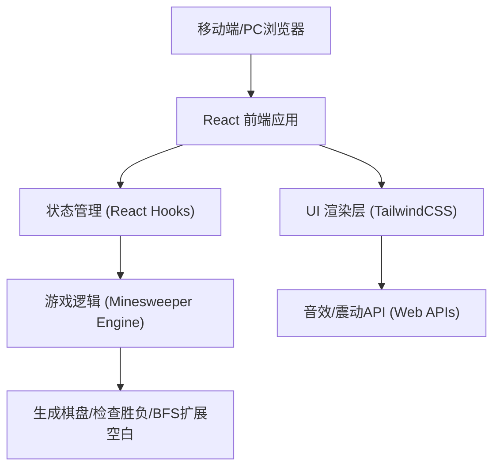

## 1. 架构设计


## 2. 技术描述
- 前端框架: React@18 + tailwindcss@3 + vite
- 初始化工具: vite-init (由 web-dev 技能组自动完成)
- UI组件: 使用 Radix UI 基础件 (如有需要) 或手写 Tailwind 组件，搭配 Lucide-React 提供高质量 SVG 图标。
- 动画库: framer-motion (用于旗帜插入、爆炸抖动、胜利撒花等动效)
- 状态管理: `useReducer` (由于扫雷状态复杂，包括棋盘二维数组、游戏状态、剩余雷数、计时器等，`useReducer` 更易维护)。
- 存储: `localStorage` (记录最高分/最短用时)。

## 3. 路由定义
| 路由 | 目的 |
|-------|---------|
| `/` | 游戏主页（单页应用，无复杂路由，通过状态切换难度和界面） |

## 4. API 定义 (无后端服务)
由于该应用为纯前端单机游戏，无后端 API。所有逻辑在客户端执行。

### 核心类型定义 (TypeScript)
```typescript
type GameStatus = 'idle' | 'playing' | 'won' | 'lost';

type Difficulty = 'beginner' | 'intermediate' | 'expert';

interface Cell {
  x: number;
  y: number;
  isMine: boolean;
  isRevealed: boolean;
  isFlagged: boolean;
  neighborMines: number;
}

interface GameState {
  board: Cell[][];
  status: GameStatus;
  minesLeft: number;
  timeElapsed: number;
  difficulty: Difficulty;
  isFlagMode: boolean; // 移动端专用的操作模式开关
}
```

## 5. 核心算法说明
1. **首次点击安全机制**：
   - 玩家点击第一个方块时，才开始在棋盘上随机布雷，并确保首次点击的方块（及其周围一圈）不含有地雷，从而保证开局必有安全区（经典 Windows 扫雷逻辑的改进版）。
2. **空白扩展（Flood Fill）**：
   - 当点击到 `neighborMines === 0` 的方块时，使用广度优先搜索 (BFS) 或深度优先搜索 (DFS) 递归/迭代翻开周围所有相连的安全方块。
3. **快速翻开（Chording）**：
   - （可选高阶技巧）在已翻开且周围标记地雷数等于 `neighborMines` 的数字方块上双击，自动翻开周围未标记的方块。

## 6. 数据模型
- 数据完全保存在前端内存 (`GameState`) 中。
- 可选：使用 `localStorage` 保存各难度的最佳通关时间：
```json
{
  "beginner_best": 12,
  "intermediate_best": 45,
  "expert_best": 110
}
```
