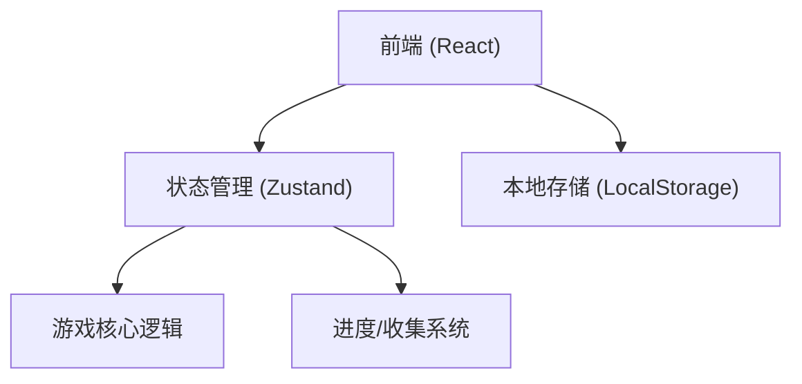
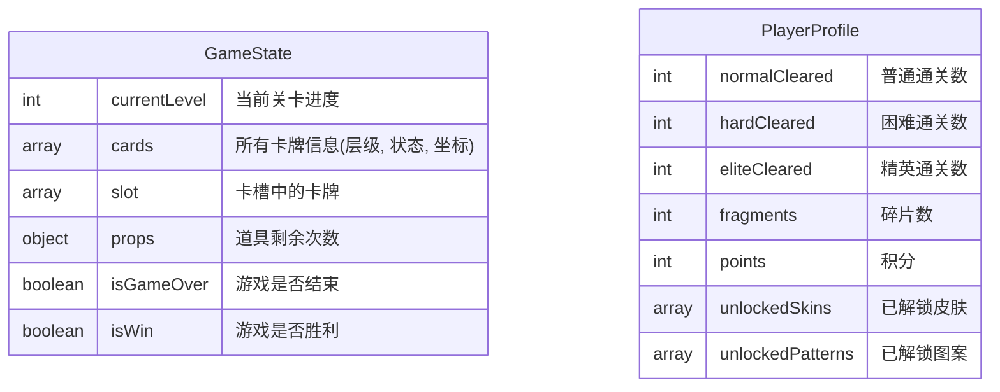

## 1. 架构设计


## 2. 技术栈说明
- 前端：React@18 + tailwindcss@3 + vite
- 初始化工具：vite-init
- 路由：react-router-dom
- 状态管理：zustand (配合 persist 中间件进行本地持久化)
- 图标库：lucide-react

## 3. 路由定义
| 路由 | 目的 |
|-------|---------|
| `/` | 首页 (主菜单、关卡入口) |
| `/game` | 核心游戏页 (游玩界面) |
| `/collection` | 收集与成就页 (图鉴、皮肤、成就) |

## 4. 数据模型 (Zustand State)
### 4.1 数据模型定义


### 4.2 卡牌对象数据结构 (TypeScript Interface)
```typescript
interface Card {
  id: string; // 唯一ID
  type: string; // 卡牌图案类型 (如 🍎, 🍌)
  layer: number; // 所在层级
  row: number; // 行位置
  col: number; // 列位置
  isCovered: boolean; // 是否被上方卡牌遮挡
  status: 'idle' | 'in-slot' | 'eliminated'; // 卡牌状态
}
```
