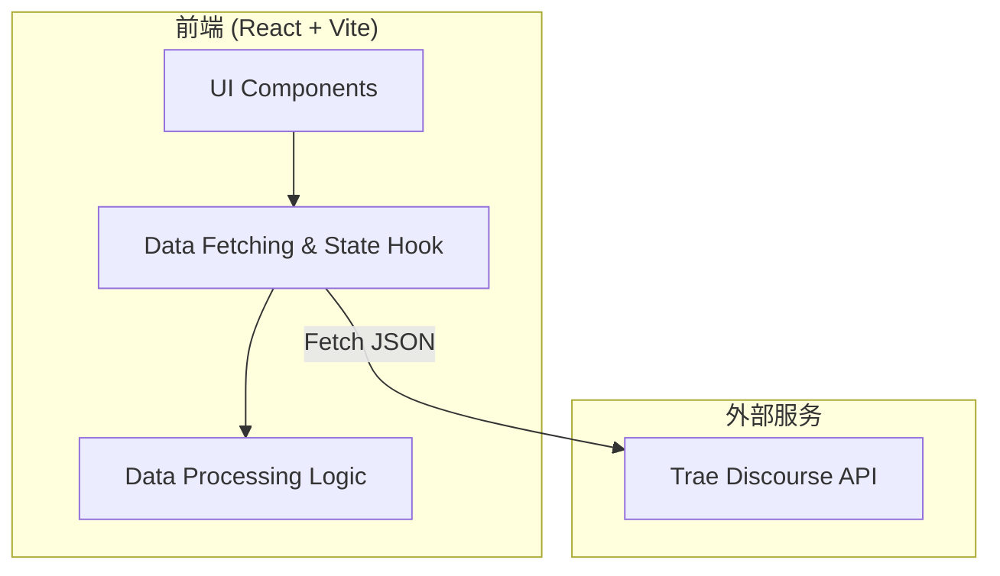

## 1. 架构设计


## 2. 技术说明
- **前端框架**: React 18
- **构建工具**: Vite
- **样式方案**: Tailwind CSS 3
- **图标库**: Lucide React
- **网络请求**: 原生 Fetch API
- **动画**: Framer Motion (用于列表项的入场动画和悬浮交互)
- **CORS处理**: 若直接调用 `https://forum.trae.cn/c/35.json` 存在跨域问题，由于是纯前端项目，可能需要配置Vite proxy（用于本地开发）或依赖Discourse开启了公开API访问。如果API公开，则直接Fetch。

## 3. 路由定义
| 路由 | 目的 |
|-------|---------|
| / | 首页榜单页面（单页应用） |

## 4. API 定义
**获取板块帖子列表**
- **Endpoint**: `GET https://forum.trae.cn/c/35-category/35.json`
- **Response Schema** (Discourse 标准格式摘要):
```typescript
interface DiscourseCategoryResponse {
  topic_list: {
    topics: Array<{
      id: number;
      title: string;
      slug: string;
      reply_count: number;
      views: number;
      like_count: number;
      created_at: string;
      last_posted_at: string;
      posters: Array<{
        user_id: number;
        primary_group_id: number;
        description: string;
      }>;
      // 可能存在 vote_count (如果安装了投票插件)
      vote_count?: number; 
    }>;
  };
  users: Array<{
    id: number;
    username: string;
    avatar_template: string;
  }>;
}
```

## 5. 数据处理逻辑
- **投票数**：读取 `topic.vote_count`，如果未安装投票插件则回退到读取 `topic.like_count`。
- **互动数**：定义为 `topic.reply_count + topic.like_count` （或加上浏览量权重，这里采用回复+点赞简单相加）。
- **数据关联**：需要将 `topic_list.topics` 中的 `posters` 关联到外层 `users` 数组以获取发帖人头像和用户名。
