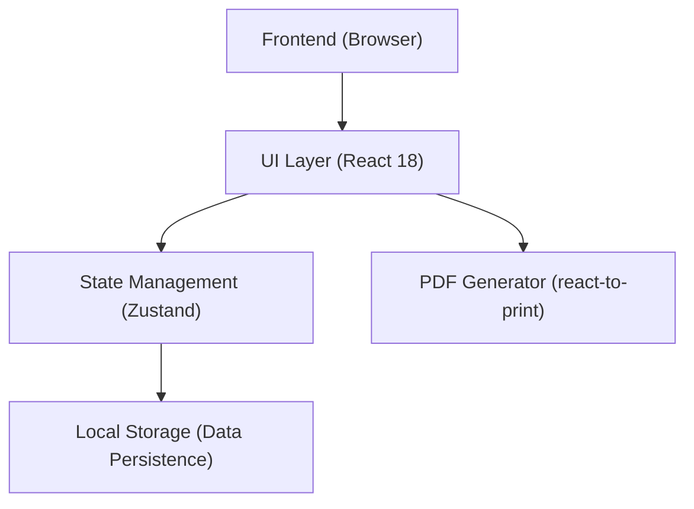

## 1. 架构设计


## 2. 技术说明
- 前端框架：React 18 + Tailwind CSS 3 + Vite
- 状态管理：Zustand
- 图标库：Lucide React
- UI组件库：Radix UI (无头组件，配合Tailwind) 或直接使用 Tailwind
- PDF 导出：react-to-print (原生打印保证最高清晰度和可选文字) / jsPDF + html2canvas (备选方案)
- 拖拽排序：@dnd-kit/core
- 持久化存储：localStorage (使用 zustand/middleware 的 persist)
- 图片压缩：browser-image-compression (纯前端本地压缩)

## 3. 路由定义
| 路由 | 用途 |
|-------|---------|
| / | 纯单页应用，首页与编辑页融合（根据状态切换，无需真实路由或使用简单的条件渲染） |

## 4. 接口定义
完全离线应用，无后端接口请求。

## 5. 数据模型
### 5.1 数据结构定义
```typescript
interface ResumeData {
  basics: {
    name: string;
    phone: string;
    email: string;
    intention: string;
    birthDate: string;
    location: string;
    avatar: string; // Base64
    showAvatar: boolean;
  };
  education: Array<{
    id: string;
    school: string;
    degree: string;
    major: string;
    startDate: string;
    endDate: string;
    description: string;
    honors: string;
  }>;
  experience: Array<{
    id: string;
    company: string;
    position: string;
    startDate: string;
    endDate: string;
    description: string;
  }>;
  projects: Array<{
    id: string;
    name: string;
    role: string;
    startDate: string;
    endDate: string;
    description: string;
    responsibilities: string;
    techStack: string;
    achievements: string;
  }>;
  skills: Array<{
    id: string;
    category: string;
    description: string;
  }>;
  summary: string;
  settings: {
    template: 'minimal' | 'business' | 'campus' | 'tech';
    themeColor: string;
    fontSize: string;
    lineHeight: string;
    layout: 'single' | 'double';
  };
}
```