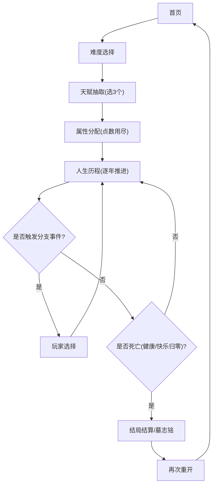

## 1. 产品概述
《人生重开模拟器》V2.0 是一款纯文字互动的网页端生命模拟游戏：从开局配置到逐年事件推进，最终生成带调侃的墓志铭总结。
- 面向：喜欢轻量互动、随机叙事、互联网梗的年轻用户（尤其是职场人）
- 价值：高复玩（难度/天赋/事件链）、低门槛（纯前端、单文件可分享）、情绪释放与幽默共鸣

## 2. 核心功能

### 2.1 用户角色
本产品不区分用户角色，无登录系统。

### 2.2 功能模块
1. **首页**：氛围背景（噪点/暗色光晕/动效）、“立即重开”主按钮（Shimmer）、开始音效
2. **难度选择**：简单/普通/困难/地狱；展示差异；确认进入下一步
3. **天赋抽取**：随机刷新 10 个天赋；按稀有度展示；必须选 3 个；支持刷新
4. **属性分配**：颜值/智力/体质/家境；加减分配；一键随机；点数用尽才能开始
5. **人生历程（主流程）**：状态栏、事件流、下一年/自动播放、分支选择暂停
6. **结局结算**：死因输出与按钮；统计数据；墓志铭生成；再来一局

### 2.3 页面详情
| 页面名称 | 模块名称 | 功能说明 |
|---|---|---|
| 首页 | 背景氛围 | 全屏黑底；动态噪点与暗色光晕（Blob）动效；适配移动端 |
| 首页 | 主按钮 | “立即重开”带 Shimmer；点击触发开始音效并进入难度页 |
| 难度选择 | 难度卡片 | 展示 4 档难度与数值影响说明；选中高亮；确认进入天赋抽取 |
| 天赋抽取 | 天赋列表 | 随机抽 10 个；蓝/紫/橙稀有度；橙色带光晕；点击切换选中 |
| 天赋抽取 | 选择限制 | 最多且必须选 3 个；未满足时禁止“继续” |
| 属性分配 | 四维分配 | 颜值/智力/体质/家境；加减按钮；显示剩余点 |
| 属性分配 | 一键随机 | 按权重分配剩余点；确保总点数守恒；点用尽后允许开始 |
| 人生历程 | 状态栏 | 顶部常驻：健康/快乐/资金；深色玻璃态（backdrop-blur）；Safe Area |
| 人生历程 | 事件流 | 逐条向下滚动；年份高亮；高亮/死亡红字样式；隐藏滚动条保留滚动 |
| 人生历程 | 控制区 | “下一年”推进；“自动播放”定频推进；遇选择或死亡自动暂停 |
| 人生历程 | 分支事件 | 遇选项暂停，展示事件与按钮；选择后追加结果事件并继续 |
| 结局结算 | 死亡确认 | 健康或快乐归零触发死亡；最后一条红字死因；“查看结局”按钮 |
| 结局结算 | 统计与墓志铭 | 年龄、死因、资产、最高健康/快乐等；墓志铭按规则生成 |
| 结局结算 | 再来一局 | 清空状态回到首页 |

## 3. 核心流程
### 3.1 用户主路径（自然语言）
用户从首页点击“立即重开”，选择难度后进入天赋抽取，必须选择 3 个天赋后进入属性分配；属性点分配完毕点击“开始新人生”，进入逐年推进的事件流；期间遇到分支事件需做选择；当健康或快乐归零时死亡，展示结算数据和墓志铭，可一键再来一局回到首页。

### 3.2 流程图（Mermaid）

## 4. 用户界面设计
### 4.1 设计风格
- 主色调：黑/深灰为底；高饱和点缀色用于稀有度（蓝/紫/橙）与关键状态
- 按钮：圆角矩形；主按钮 Shimmer；按压反馈与微弱发光
- 字体：标题使用更具性格的展示字体，正文使用易读中文无衬线；数字等宽化提升“状态面板”可读性
- 布局：单屏分步流程（类似向导）；主流程使用“顶部状态栏 + 下方事件流 + 底部控制区”
- 动效：噪点漂移、Blob 浮动、事件追加的淡入上移、死亡的红色闪烁/抖动弱反馈

### 4.2 页面设计概览
| 页面名称 | 模块名称 | UI 元素 |
|---|---|---|
| 首页 | 氛围与入口 | 黑底+噪点层+Blob 光晕；Shimmer 主按钮；轻音效 |
| 难度选择 | 4 档选择 | 卡片式选择；差异说明小字；选中边框发光 |
| 天赋抽取 | 抽卡面板 | 10 张卡片网格；稀有度彩边；橙卡外发光；选中态更强高亮 |
| 属性分配 | 四维面板 | 4 行属性；加减按钮；剩余点进度；一键随机按钮 |
| 人生历程 | 事件控制台 | 顶部玻璃态状态栏；事件日志滚动；底部控制按钮；分支弹层 |
| 结局结算 | 总结卡 | 统计信息；墓志铭大字；“再来一局”主按钮 |

### 4.3 响应式与可用性
- 桌面优先，移动端自适应：控制区固定底部并增加 Safe Area padding，避免遮挡
- 隐藏滚动条但保留滚动：事件流区域可滑动
- 可访问性：按钮具备焦点态；颜色对比度满足可读性；减少过强闪烁

