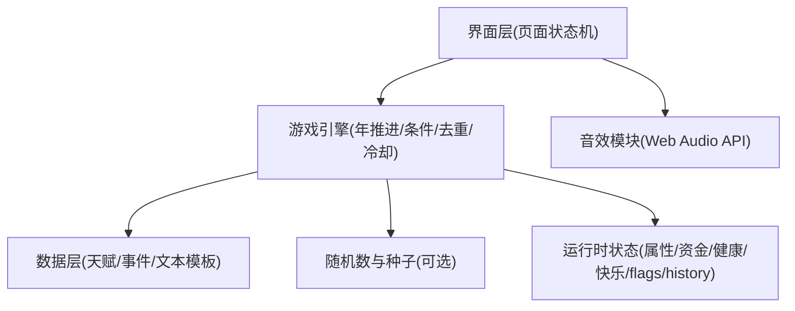

## 1. 架构设计
本项目为纯前端单页应用（SPA），无后端、无数据库；所有数据（天赋、事件、结局文案规则）以内置 JSON/对象形式存在于前端。支持构建为单一 `index.html`（JS/CSS/音效内联）以便分享。

## 2. 技术选型说明
- 前端：原生 HTML + CSS + JavaScript（无需框架，离线可运行）
- 构建（可选）：Vite + vite-plugin-singlefile（将资源内联到单文件）
- 数据：内置静态数据（天赋池、事件池、墓志铭规则）
- 多媒体：Web Audio API 合成音效（点击/开始/死亡）
- 运行环境：现代浏览器（Chrome/Edge/Safari 移动端）

## 3. 路由/页面状态定义
本项目采用“页面状态机”代替传统路由：
| 状态 | 用途 |
|---|---|
| home | 首页入口 |
| difficulty | 难度选择 |
| talent | 天赋抽取 |
| attrs | 属性分配 |
| run | 人生历程主流程 |
| summary | 结局结算 |

## 4. 核心数据结构（前端内存模型）
### 4.1 运行时状态
- `difficulty`: 选中的难度配置（点数/资金/衰减倍率等）
- `talents`: 已选择天赋列表（含稀有度、加成、flags）
- `attrs`: 四维属性（颜值/智力/体质/家境）
- `status`: 动态数值（年龄、健康、快乐、资金）
- `flags`: 剧情标记集合（如 `skippedSchool`、`hasLover`、职业线标记等）
- `eventHistory`: 事件触发记录（用于去重/冷却）
- `stats`: 统计项（最高健康/快乐、总资产变化等）

### 4.2 天赋定义
| 字段 | 类型 | 说明 |
|---|---|---|
| id | string | 唯一标识 |
| name | string | 天赋名称 |
| rarity | "blue" \| "purple" \| "orange" | 稀有度 |
| desc | string | 文案描述 |
| add | object | 属性/状态加成（可选） |
| flags | string[] | 解锁/剧情标记（可选） |

### 4.3 事件定义
| 字段 | 类型 | 说明 |
|---|---|---|
| id | string | 唯一标识 |
| age | number \| null | 固定年龄（可选）；为空则按年龄段抽取 |
| stage | "child" \| "teen" \| "adult" \| "mid" | 年龄段 |
| tags | string[] | 事件标签（如程序员/运营/修仙） |
| weight | number | 抽取权重 |
| cond | function | 条件校验（依赖属性/flags） |
| effect | function | 对状态的影响（健康/快乐/资金/flags） |
| text | string | 事件文本 |
| choices | {label:string, nextEffect:function, nextText?:string}[] \| null | 分支选择（可选） |

## 5. 引擎关键规则映射
- 固定年龄事件优先：按 `age` 精确匹配并优先触发
- 随机事件过滤：按 `stage` + `tags` + `cond` 过滤候选池，再按 `weight` 抽取
- 去重与冷却：事件进入 `eventHistory`；3 年内不可重复；之后触发权重衰减 50%
- 兜底日常：候选为空则从日常池抽取，避免年表空白/重复感
- 健康自然衰减：50 岁前不掉血；50+ 依据年龄增长、体质、难度参数计算
- 自动播放：定频推进；遇分支/死亡暂停

## 6. 部署与构建（可选）
- 单文件产物：输出单一 `index.html`，便于静态托管与分享
- 部署方式：任意静态站点（GitHub Pages / Netlify / Vercel 静态 / 本地打开）

