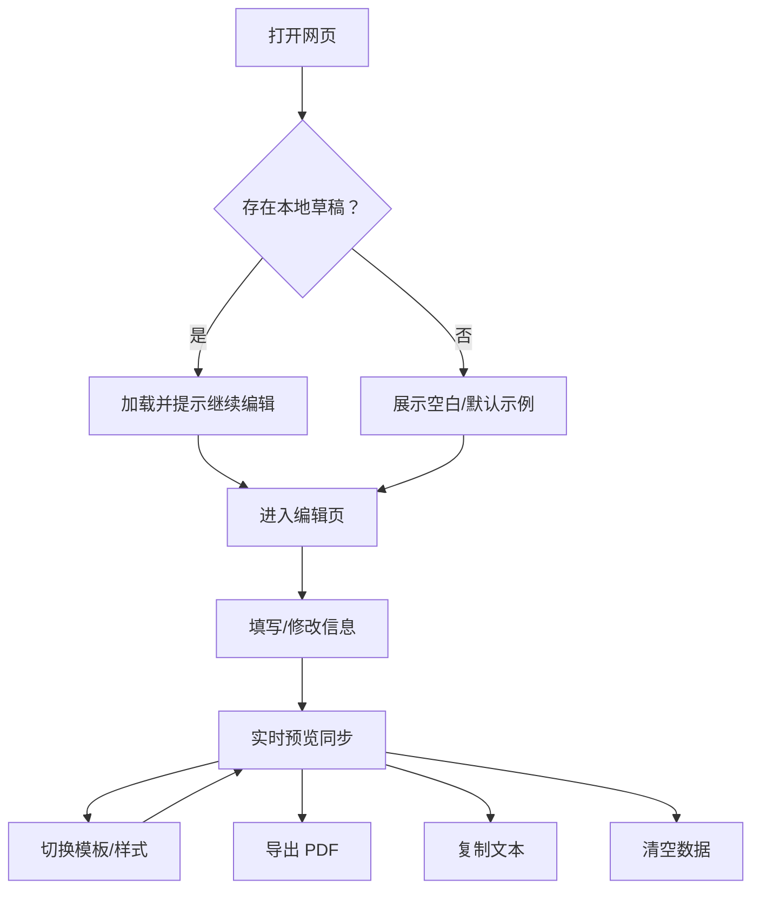

## 1. 产品概述
纯前端、离线可用的在线简历生成器：用户在浏览器本地完成信息填写、模板切换与实时预览，并一键导出可打印的 A4 PDF。
- 解决“做简历麻烦/模板难找/隐私担忧/导出不清晰”的问题，面向求职者与应届生，打开即用，用完即走
- 价值：零门槛、隐私友好、导出稳定、可复用（本地自动保存）

## 2. 核心功能

### 2.1 用户角色
本产品无登录/注册，无角色体系；默认“访客用户”即可使用全部功能。

### 2.2 功能模块
1. **首页**：产品介绍、立即创建、最近一次草稿提示（来自本地缓存）
2. **编辑页**：信息编辑、模板/样式设置、实时预览、PDF 导出、复制文本、重置与清空

### 2.3 页面功能明细
| 页面名称 | 模块名称 | 功能描述 |
|---|---|---|
| 首页 | 介绍区 | 简短卖点说明：纯前端离线、隐私本地、实时预览、导出无水印 PDF |
| 首页 | 立即创建 | 跳转编辑页；若存在本地草稿则提示“已自动恢复上次内容” |
| 编辑页 | 顶部工具栏 | 模板选择（4–6 套）、主题色、字号、段落间距、单/双列、显示头像开关、导出 PDF、复制文本、重置/清空 |
| 编辑页 | 编辑区：基础信息 | 姓名/电话/邮箱/意向/出生日期/现居地；头像上传（本地选择+前端压缩）；每项可单独控制“显示/隐藏” |
| 编辑页 | 编辑区：教育经历 | 多条记录；字段：学校/学历/专业/入学/毕业；支持描述/荣誉；支持新增/删除/上移下移排序 |
| 编辑页 | 编辑区：工作/实习经历 | 多条记录；字段：公司/职位/时间/内容；支持新增/删除/上移下移排序 |
| 编辑页 | 编辑区：项目经历 | 多条记录；字段：项目名/角色/时间/描述/职责/技术栈/成果；支持新增/删除/上移下移排序 |
| 编辑页 | 编辑区：技能证书 | 标签型输入：专业技能/语言能力/证书/荣誉奖项；支持熟练度描述 |
| 编辑页 | 编辑区：自我评价 | 多行输入；实时字数统计与超限提示（可配置上限，默认 300–500） |
| 编辑页 | 预览区：A4 模拟 | A4 纸张与边距、分页提示（按 A4 高度显示分页分隔线/阴影提示） |
| 编辑页 | 实时同步 | 输入后预览即时更新；切换模板/布局/主题不丢内容 |
| 编辑页 | 导出 PDF | 纯前端导出 A4 PDF（无水印、清晰可打印）；支持多页 |
| 编辑页 | 本地保存 | localStorage 自动保存；刷新恢复；提供“清空数据”按钮 |

## 3. 核心流程
### 3.1 主要用户流程（文字）
- 用户打开网页：自动读取本地草稿（若存在），首页展示“继续编辑”
- 进入编辑页：左侧填写/调整内容，右侧实时预览
- 选择模板与样式：主题色/字号/间距/布局/头像显示，预览自动适配
- 导出：点击导出按钮，生成 A4 PDF 并下载
- 可选：复制简历文本、重置到默认示例、或清空本地数据

### 3.2 流程图（Mermaid）

## 4. 用户界面设计

### 4.1 设计风格
- 视觉方向：编辑器式“工具感” + 纸张式“出版物感”，强调可打印与可信赖
- 色彩：以中性灰/纸张白为底，主题色作为强调（按钮/标题/分隔线）
- 字体：标题使用高识别度无衬线显示字体，正文使用更易读的正文字体；字号可调并保证 A4 输出一致性
- 布局：桌面端左右分栏（编辑 40% / 预览 60%）；预览区固定 A4 宽度并居中；支持单/双列模板
- 动效：轻量过渡（模板切换淡入、按钮反馈、保存状态提示），不影响导出稳定性

### 4.2 页面设计概览
| 页面名称 | 模块名称 | UI 要素 |
|---|---|---|
| 首页 | 介绍区 | 1 句主标题 + 2–3 条卖点；“立即创建”主按钮；可见的隐私声明（仅本地保存） |
| 编辑页 | 顶部工具栏 | 模板缩略卡/下拉；主题色选择器；导出主按钮；次按钮（复制/清空/重置） |
| 编辑页 | 左侧编辑区 | 分组折叠面板（基础/教育/工作/项目/技能/评价）；排序按钮；标签输入；字数计数器 |
| 编辑页 | 右侧预览区 | A4 纸张阴影与边距；分页提示线；可点击“仅预览/仅编辑”模式（可选） |

### 4.3 响应式
- 桌面优先：≥1024px 默认左右分栏
- 平板：可切换上下布局（编辑在上、预览在下）
- 手机：仅浏览预览为主，编辑表单可用但默认折叠；不保证复杂拖拽体验

## 5. 非功能与约束
- 纯前端：无后端接口、无上传、无登录注册
- 离线：核心编辑/预览/导出在无网络下可用（首次加载后）
- 隐私：不采集个人数据，不埋点，不输出到第三方服务
- 兼容：Chrome / Edge / Safari 主流版本

## 6. 不做清单
- 不做用户中心/简历管理/多文件管理
- 不做在线分享/链接分享/云端同步
- 不做广告弹窗/外链跳转
