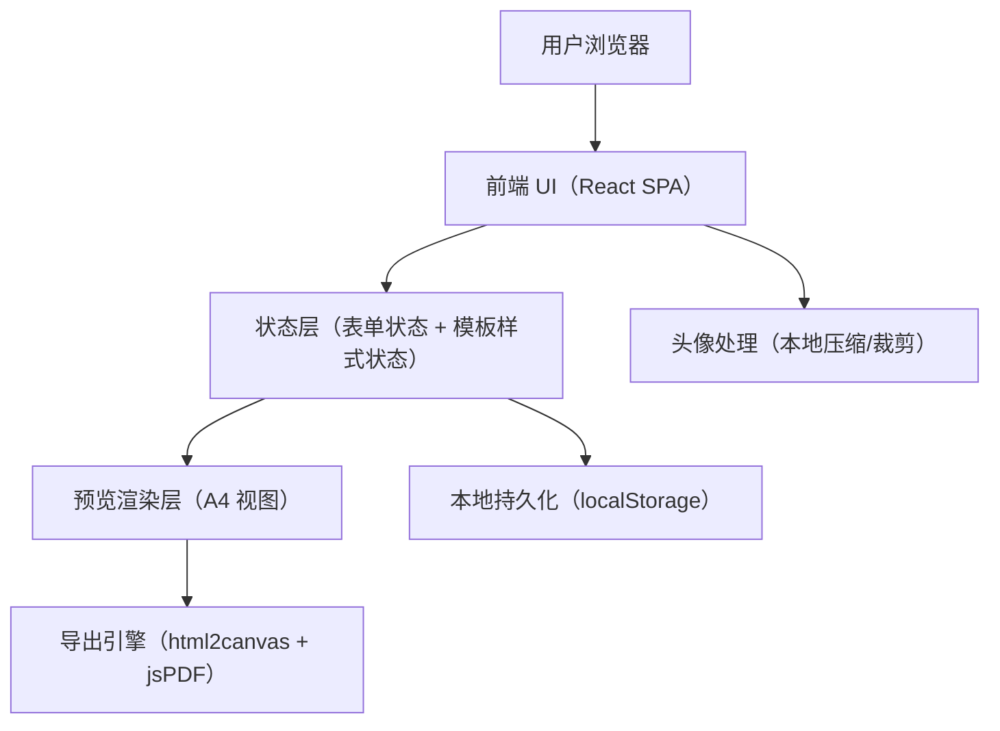

## 1. 架构设计


## 2. 技术说明
- 前端：React@18 + TypeScript + Vite
- 样式：Tailwind CSS@3（配合 CSS 变量做主题色/字号/间距），少量自定义 CSS 用于 A4 分页提示与打印表现
- 表单：React 受控组件 + 自定义可复用字段组件（支持显示开关、排序、标签输入）
- PDF 导出：html2canvas（将预览 DOM 渲染为高清位图）+ jsPDF（按 A4 分页组装并下载）
- 数据存储：localStorage（带版本号与迁移策略）
- 图片处理：浏览器端 Canvas 压缩（限定最大边长与质量），生成预览与导出一致的头像资源
- 离线：使用 PWA Service Worker 缓存静态资源（可选，但推荐启用）

## 3. 路由定义
| 路由 | 用途 |
|---|---|
| / | 首页：介绍与“立即创建/继续编辑” |
| /editor | 编辑页：编辑区 + 预览区 + 导出 |

## 4. 关键模块划分
| 模块 | 责任 |
|---|---|
| state/resume | 简历数据结构、增删改排序、字段显示开关 |
| state/settings | 模板选择、主题色、字号、间距、布局、头像显示 |
| persistence | localStorage 读写、节流保存、版本迁移、清空 |
| templates | 4–6 套模板组件（输入同一份 Resume 数据，输出不同布局样式） |
| preview | A4 预览容器、分页提示计算、缩放适配 |
| export | 导出流程、分辨率策略、分页裁切、字体与跨页处理 |
| image | 头像压缩与裁剪、格式兼容（png/jpg/webp） |
| clipboard | 纯文本导出（按模块拼接，可复制） |

## 5. 数据模型（前端本地）

### 5.1 TypeScript 类型（核心字段）
```ts
export type SwitchableText = {
  value: string
  visible: boolean
}

export type BasicInfo = {
  name: SwitchableText
  phone: SwitchableText
  email: SwitchableText
  target: SwitchableText
  birthday: SwitchableText
  location: SwitchableText
  avatarDataUrl?: string
  avatarVisible: boolean
}

export type Education = {
  id: string
  school: string
  degree: string
  major: string
  start: string
  end: string
  description?: string
  honors?: string
}

export type Experience = {
  id: string
  company: string
  title: string
  start: string
  end: string
  content: string
}

export type Project = {
  id: string
  name: string
  role: string
  start: string
  end: string
  description: string
  duties: string
  techStack: string[]
  achievements?: string
}

export type SkillBlock = {
  skills: { name: string; level?: string }[]
  languages: { name: string; level?: string }[]
  certificates: string[]
  honors: string[]
}

export type Resume = {
  version: number
  basic: BasicInfo
  education: Education[]
  experience: Experience[]
  projects: Project[]
  skillBlock: SkillBlock
  summary: { text: string }
}

export type Settings = {
  templateId: string
  themeColor: string
  fontScale: number
  paragraphSpacing: number
  layout: "single" | "double"
}
```

### 5.2 localStorage 约定
- Key：resume_builder_v1
- 内容：{ resume, settings, updatedAt }
- 保存策略：编辑时节流（例如 300–800ms），切换模板/导出前强制保存一次
- 迁移策略：读取时根据 version 做轻量迁移（缺字段补默认值）

## 6. PDF 导出策略（质量与稳定性）
- 预览容器固定 A4 宽度（mm→px 通过 DPI 转换），导出时按更高倍率渲染（例如 scale=2 或 3）
- 采用“整页截图 + 分页裁切”策略：以 A4 高度切片并逐页写入 jsPDF
- 字体策略：优先使用系统可用字体 + 可选内置字体文件（确保中文不丢字）；不依赖线上字体服务
- 兼容策略：对 Safari 做降级（降低 scale 或关闭某些滤镜），保证可导出
