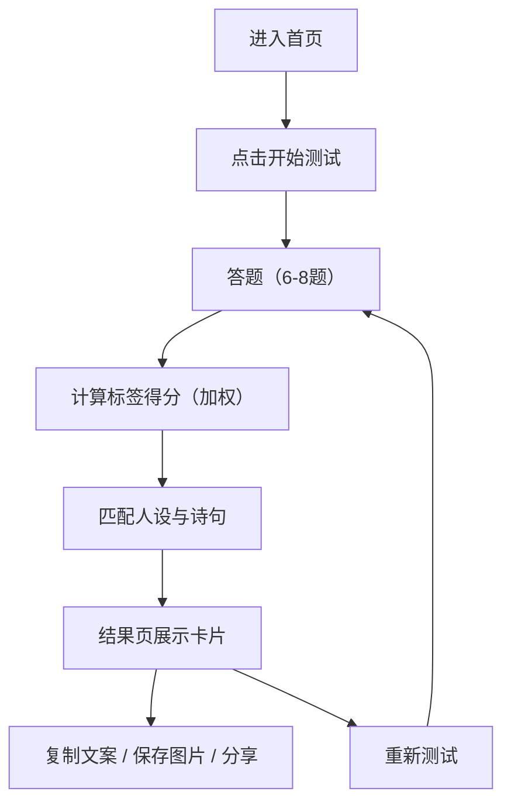

## 1. 产品概述
「千古名句人格测试 · 诗词小站」是一款轻量治愈的趣味测试网页，通过 6–8 道选择题匹配专属诗词名句与“诗词人设”，生成可分享的古风卡片。
- 目标用户：喜欢古风/诗词/性格测试、乐于社交平台分享的年轻用户
- 核心价值：低门槛互动 + 文艺情绪价值 + 强分享传播

## 2. 核心功能

### 2.1 用户角色
本产品无登录体系，默认单一角色：访客用户。

### 2.2 功能模块
1. **首页**：产品介绍、开始测试入口、氛围背景与品牌调性
2. **测试答题页**：单题一屏、进度条、选项选择、上一题/下一题、答题完成自动结算
3. **结果卡片页**：诗句+人设称号+性格解读、生成海报（Canvas）、复制文案、保存图片、重新测试、彩蛋（随机诗词知识/小知识）

### 2.3 页面详情
| 页面名称 | 模块名称 | 功能描述 |
|---|---|---|
| 首页 | 标题/口号 | 标题「千古名句人格测试」+ 一句话 Slogan（轻量治愈、易分享） |
| 首页 | 开始按钮 | 点击进入答题页，初始化一次测试会话 |
| 首页 | 背景氛围 | 新中式淡雅底纹/纸感/墨色渐变，极简不花哨 |
| 测试答题页 | 题目卡片 | 每题独立一页（点击切换，移动端支持左右滑动） |
| 测试答题页 | 选项按钮 | 3–4 个选项，点击即记录分值与标签权重 |
| 测试答题页 | 进度条 | 显示当前题/总题数，并有轻量动效反馈 |
| 测试答题页 | 操作区 | 上一题/下一题；最后一题提交并生成结果 |
| 结果卡片页 | 诗句展示区 | 显示匹配诗句（含作者+朝代） |
| 结果卡片页 | 人设称号 | 例如「佛系隐士」「浪漫谪仙」「清冷墨客」等 |
| 结果卡片页 | 性格解读 | 年轻语境、可读性强的现代解读（不晦涩） |
| 结果卡片页 | 生成海报 | 将结果渲染为 Canvas 并导出 PNG（可保存/分享） |
| 结果卡片页 | 分享能力 | 一键复制文案（剪贴板）、保存图片、重新测试 |
| 结果卡片页 | 彩蛋 | 随机一句诗词小知识或来源背景（非必须但默认提供） |

## 3. 核心流程

### 3.1 用户主流程（文字）
用户进入首页 → 点击开始 → 逐题作答（可返回修改）→ 完成后系统按权重计算人格标签 → 匹配“人设”与“千古名句” → 展示结果卡片 → 复制文案/保存海报/分享 → 可选择重新测试。

### 3.2 流程图（Mermaid）

## 4. 内容与规则

### 4.1 题库规则
- 题量：默认 8 题（可配置到 6–8 题）
- 每题选项：3–4 个
- 每个选项映射 1–2 个“气质标签”，并带权重（例如 +2、+1）
- 标签示例（可扩展）：豁达、治愈、清冷、浪漫、励志、淡然、热烈、通透

### 4.2 名句库规则
- 内置不少于 30 句经典诗词
- 每条名句包含：诗句、作者、朝代、所属气质标签、人设称号、现代解读、配套彩蛋知识
- 同一标签可对应多条名句：按得分最高标签为主，次高标签作为微调，最终在候选集中随机择一（增加复测新鲜感）

### 4.3 结果生成规则（简化且可解释）
1. 统计所有标签得分
2. 找到得分最高标签作为主气质
3. 如最高分存在并列：优先使用“最近一次选择”的权重更高标签；仍并列则随机
4. 在主气质名句库中按“次气质”加权筛选/排序，再随机选取 1 条作为最终结果

## 5. 交互与体验
- 响应式：手机优先体验良好，同时兼容平板、桌面
- 动效：只使用轻量过渡（淡入、位移、按钮按压反馈），避免复杂动画导致卡顿
- 加载：首屏有简洁加载/入场动画（可选），答题与结果切换顺畅
- 可用性：按钮可点区域大；移动端滑动与点击均可操作

## 6. 视觉与文案风格

### 6.1 设计风格
- 新中式简约古风：淡雅、干净、高级、有纸感/墨韵
- 配色：低饱和米白/浅灰/墨黑/淡青/柔粉等
- 字体：标题偏古风（展示字体），正文现代清晰（无衬线或易读宋体风格皆可）

### 6.2 视觉组件建议
- 卡片：细边框、轻阴影、纸张纹理或淡墨晕染背景
- 进度条：细线条 + 圆点节点，低饱和强调色
- 按钮：圆角、克制的高亮与按压反馈

## 7. 非功能性需求
- 纯前端实现，无后端数据库依赖
- 离线可用（除字体加载等外部资源可选）
- 不收集个人信息；不使用第三方埋点（可后续迭代）

## 8. 可选迭代（后期）
- 今日诗词签：每天随机一句签文 + 轻解读
- 输入名字生成卡片：名字作为随机种子，生成更“专属”的结果
- 飞花令小工具：关键词匹配诗句挑战
- 结果页同类诗词推荐：展示 2–3 条同气质名句
