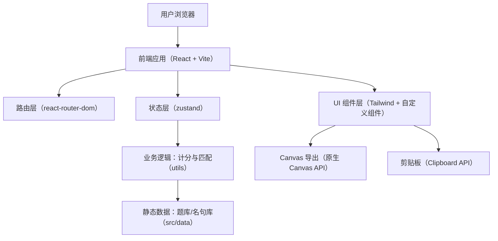

## 1. 架构设计
本项目为纯前端单页应用（SPA），不依赖后端服务；题库、名句库以内置静态数据形式存在。核心流程为：答题 → 标签加权计分 → 匹配结果 → 结果渲染与 Canvas 导出。



## 2. 技术说明
- 前端：React@18 + TypeScript + Vite
- 样式：Tailwind CSS（配合 CSS 变量做主题色/纸感背景/纹理）
- 路由：react-router-dom
- 状态管理：zustand（存放答题进度、选择记录、计算出的结果）
- 数据：本地静态 JSON/TS 常量（题库、名句库、彩蛋知识）
- 图片保存：原生 Canvas API 绘制结果卡片并导出 PNG（避免依赖 html2canvas 等外部库）

## 3. 路由定义
| 路由 | 用途 |
|---|---|
| / | 首页：介绍与开始入口 |
| /quiz | 答题页：单题一屏、进度与切换 |
| /result | 结果页：展示结果与生成/保存/分享 |

## 4. 数据结构（前端模型）

### 4.1 TypeScript 类型（示意）
```ts
export type PersonaTag =
  | "豁达洒脱"
  | "温柔治愈"
  | "清冷孤傲"
  | "浪漫深情"
  | "励志昂扬"
  | "佛系淡然"

export type QuestionOption = {
  id: string
  text: string
  weights: Partial<Record<PersonaTag, number>>
}

export type Question = {
  id: string
  title: string
  subtitle?: string
  options: QuestionOption[]
}

export type Quote = {
  id: string
  line: string
  author: string
  dynasty: string
  tags: PersonaTag[]
  personaTitle: string
  modernInterpretation: string
  easterEgg?: string
}

export type QuizResult = {
  primaryTag: PersonaTag
  secondaryTag?: PersonaTag
  quote: Quote
  score: Record<PersonaTag, number>
}
```

### 4.2 静态数据组织
- src/data/questions.ts：题库（6–8 题，可配置）
- src/data/quotes.ts：名句库（≥30 条），含标签、人设称号、解读、彩蛋
- src/data/theme.ts：主题色与字体配置（可选）

## 5. 核心算法（计分与匹配）
- 输入：用户对每题的选项选择
- 计分：将每个选项的 weights 累加到 score
- 主标签：score 最高者（并列按“最后一次选择”优先；仍并列随机）
- 次标签：score 第二高者（可选，用于在主标签候选集中排序/加权）
- 匹配：从 quotes 中筛选包含主标签的条目，再根据次标签偏好排序后随机择一

## 6. Canvas 导出方案
- 采用“结果卡片 Canvas 模板”而非截图 DOM
- 将以下要素绘制到 Canvas：
  - 纸感背景（渐变 + 轻噪点/纹理，可用程序生成）
  - 诗句（大字号）、作者/朝代、人格称号、现代解读（自动换行）
  - 小印章/落款（可用简单几何图形绘制）
- 输出：canvas.toDataURL("image/png") 或 canvas.toBlob 触发下载

## 7. 可访问性与适配
- 语义化按钮与标题层级；聚焦可见（focus ring）
- 移动端触控：按钮高度与间距适配
- 断点策略：桌面优先布局，移动端自适应（单列、较大点击区域）

## 8. 安全与隐私
- 不收集用户隐私数据
- 不写入日志敏感信息
- 仅使用浏览器本地存储保存“上一次结果”（可选），支持清除
